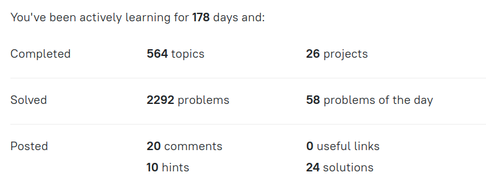

[Fullstack](#fullstack) | [Front-End](#front-end) | [Back-End](#back-end) | [Java](#java) | [Kotlin](#kotlin) | [C++](#c) | [Android with Java](#android-with-java)

# Projects - KronosGR

## Fullstack

- **Notez**(in progress) - [Source Code](https://github.com/kronosGR/KandZ-Notez)
  - Typescript
  - React.js
  - Rx.js
  - BootStrap
  - Node.js
  - Express.js
  - MongoDb

## Front-End

- **Weather** [Web](https://weather.kandz.me/) - [Google Play Store](https://play.google.com/store/apps/details?id=net.kandz.weather)

  - Ionic
  - React.js

- **Wind Converter** [Web](https://windconverter.kandz.me/) - [Google Play Store](https://play.google.com/store/apps/details?id=windconverter.kandz.me)

  - Ionic
  - React.js

- **Chrono Calculator** [Web](https://chronocalculator.kandz.me/) - [Google Play Store](https://play.google.com/store/apps/details?id=me.kandz.chronocalculator)

  - Ionic
  - React.js

- **Holidaze** - [Source Code](https://github.com/kronosGR/ca-portfolio-react)

  - HTML
  - CSS
  - Javascript
  - STRAPI
  - Next.js / React.js

- **Pet Paradise** - [Source Code](https://github.com/kronosGR/Georgios-Katsanakis-semester-project-2)

  - HTML
  - CSS
  - Javascript
  - STRAPI

- **Clothing Practice Store** - [Source Code](https://github.com/kronosGR/React.js-crown-clothing)

  - HTML
  - CSS
  - Javascript
  - React.js
  - Firebase

- **JS World** - [Source Code](https://github.com/kronosGR/JSWorld)

  - HTML
  - CSS
  - Javascript
  - Wordpress

- **Porfolio 2nd year** - [Source Code](https://github.com/kronosGR/9-portfolio-2-reactjs)

  - HTML
  - CSS
  - Javascript
  - React.js

- **Porfolio 1st year** - [Source Code](https://github.com/kronosGR/portfolio)

  - HTML
  - CSS
  - Javascript
  - Wordpress

- **Game Hub** - [Source Code](https://github.com/kronosGR/GameHub)

  - HTML
  - CSS
  - Javascript
  - Wordpress

- **Community Science Museum** - [Source Code](https://github.com/kronosGR/CSM)
  - HTML
  - CSS
  - Javascript
  - Wordpress

[Top](#projects---kronosgr)

## Back-end

### Node.js

- **Animal Adoption** - [Source Code] (https://github.com/kronosGR/Node.js-Mysql-example)

  - Node.js
  - Express.js
  - Sequelize
  - MySQL
  - EJS template engine
  - JQuery

- **Meme Central** - [Source Code](https://github.com/kronosGR/Georgios_Katsanakis_JAN23FT_JSS)
  - Node.js
  - Express.js
  - Passport (for authentication)
  - Passport-local (for local strategy)
  - EJS template engine
  - Express-Session (session middleware)
  - Express-Session-JSON (JSON file session storage)
  - JQuery

### Java

- **Account Service** - [Source Code](https://github.com/kronosGR/Java-AccountService/tree/master/Account%20Service/task/src)  
  _Master the Spring Security module, learn the basics of user authentication and authorization, know how to register security events, and get acquainted with various requirements, such as modern information security standards for web applications._
- **Code Sharing Platform** - [Source Code](https://github.com/kronosGR/Java-CodeSharingPlatform/tree/master/Code%20Sharing%20Platform/task/src)  
  _Get acquainted with server development on Spring Boot and touch on some basic topics in Web-programming such as HTML, CSS, and JS._
- **Recipes** - [Source Code](hhttps://github.com/kronosGR/Java-Recipes/tree/master/Recipes/task/src)  
  _Get to know the backend development. Use Spring Boot to complete this project. Learn about JSON, REST API, Spring Boot Security, H2 database, LocalDateTime, Project Lombok, and other concepts useful for the backend._
- **Cinema Room REST Service** - [Source Code](https://github.com/kronosGR/Java-CinemaRoomRESTService/tree/master/Cinema%20Room%20REST%20Service/task/src)  
   _create a simple Spring REST service that will help you manage a small movie theatre. Handle HTTP requests in controllers, create services and respond with JSON objects._

[Top](#projects---kronosgr)

## Java

- ### Challenging

  - **Account Service** - [Source Code](https://github.com/kronosGR/Java-AccountService/tree/master/Account%20Service/task/src)  
    _Master the Spring Security module, learn the basics of user authentication and authorization, know how to register security events, and get acquainted with various requirements, such as modern information security standards for web applications._
  - **Blockchain** - [Source Code](https://github.com/kronosGR/Java-Blockchain/tree/master/Blockchain/task/out/production/classes/blockchain)  
    _Get a profound understanding of how blockchains work, apply your hashing and multithreading skills and learn about (de)serialization: many great topics in one exciting project._
  - **Battleship** - [Source Code](https://github.com/kronosGR/Java-Battleship/tree/master/Battleship/task/src/battleship)  
    _Understand the process of developing such a complex program as a game and learn about processing user input and handling errors.._
  - **Code Sharing Platform** - [Source Code](https://github.com/kronosGR/Java-CodeSharingPlatform/tree/master/Code%20Sharing%20Platform/task/src)  
    _Get acquainted with server development on Spring Boot and touch on some basic topics in Web-programming such as HTML, CSS, and JS._
  - **Contacts** - [Source Code](https://github.com/kronosGR/Java-Contacts/tree/master/Contacts/task/src/contacts)  
    _Learn the essential basics of object-oriented programming: encapsulation, inheritance and polymorphism. Inheritance will allow you to write code that can perform the same process but for different objects. Polymorphism helps to initiate different processes for different objects by using the same method. Also learn to prevent other users of your code to modify the variables using encapsulation._
  - **Readability Score** - [Source Code](https://github.com/kronosGR/Java-ReadabilityScore/tree/master/Readability%20Score/task/src/readability)  
    _Learn to call programs from the command-line and get more experience with using regexes and Math class._
  - **Recipes** - [Source Code](hhttps://github.com/kronosGR/Java-Recipes/tree/master/Recipes/task/src)  
    _Get to know the backend development. Use Spring Boot to complete this project. Learn about JSON, REST API, Spring Boot Security, H2 database, LocalDateTime, Project Lombok, and other concepts useful for the backend._

- ### Hard

  - **Cinema Room REST Service** - [Source Code](https://github.com/kronosGR/Java-CinemaRoomRESTService/tree/master/Cinema%20Room%20REST%20Service/task/src)  
    _create a simple Spring REST service that will help you manage a small movie theatre. Handle HTTP requests in controllers, create services and respond with JSON objects._
  - **Amazing Numbers** - [Source Code](https://github.com/kronosGR/Java-Amazing_Numbers/tree/master/Amazing%20Numbers/task/src/numbers)  
    _The project covers basic operations on integers, as well as with collections. Make a program that indicates the properties of the numbers taken from the input._
  - **Car Sharing** - [Source Code](https://github.com/kronosGR/JAVA-CarSharing/tree/master/Car%20Sharing/task/src/carsharing)  
    _During the project implementation, you will learn the basics of SQL and work with the H2 database. You will also learn about advanced Java features such as Collections._
  - **Coffee Machine** - [Source Code](https://github.com/kronosGR/Java_CoffeeMachine/tree/master/Coffee%20Machine/task/src/machine)  
    _This project allows you to better understand the basic OOP, its main concepts such as classes, class methods and attributes, and get a taste of Java. Practice working with methods, challenge yourself with loops and conditions, and get more confident with OOP._
  - **File Type Analyzer** - [Source Code](https://github.com/kronosGR/Java-FileTypeAnalyzer/tree/master/File%20Type%20Analyzer/task/src/analyzer)  
    _Figure out multithreading and learn to work with Knuth-Morris-Pratt algorithm, a must-know for every developer. Consider Rabin-Karp algorithm the icing on the cake._
  - **JSON Database** - [Source Code](https://github.com/kronosGR/Java-JSONdatabase/tree/master/JSON%20Database/task/src)  
    _Get a firm grasp of working with JSON in Java. Also practice parallelization and see how to implement processing multiple requests at the same time._
  - **JSON-XML converter**(2/6) - [Source Code](https://github.com/kronosGR/Java_JSON-XMLconverter/tree/master/JSON%20-%20XML%20converter/task/src/converter)  
    _Get to know both formats (JSON and XML), gain more experience with collections and figure out object-oriented programming once and for all._

- ### Medium

  - **Cinema Room Manager** - [Source Code](https://github.com/kronosGR/Java_CinemaRoomManager/tree/master/Cinema%20Room%20Manager/task/src/cinema)  
    _This project is a good opportunity to work with input and output in Java. You will deal with arrays and functions as well as loops and conditional statements._
  - **Encryption-Decryption** - [Source Code](https://github.com/kronosGR/Java-Encryption-Decryption/tree/master/Encryption-Decryption/task/src/encryptdecrypt)  
    _Gradually get familiar with Java, paying special attention to working with files and the command line._
  - **Music Advisor** - [Source Code](https://github.com/kronosGR/Java-MusicAdvisor/tree/master/Music%20Advisor/task/src/advisor)  
    _Work with Spotify’s API, get acquainted with Java Generics and apply design patterns to make your code from good to superb._
  - **Number Base Converter** - [Source Code](https://github.com/kronosGR/Java-NumberBaseConverter/tree/master/Number%20Base%20Converter/task/src/converter)  
    _Master loops and functions, learn about numeric data types, and explore different numeral systems including binary — one of the basic concepts in programming._
  - **Tic-Tac-Toe with AI** - [Source Code](https://github.com/kronosGR/Java_Tic-Tac-ToeWithAI/tree/master/Tic-Tac-Toe%20with%20AI/task/src/tictactoe)  
    _Get to know a lot about planning and developing a complex program from scratch, using classes and methods, handling errors, and processing user input. Learn to use OOP (Object-Oriented Programming) in the process._
  - **SQLite Viewer** - [Source Code](https://github.com/kronosGR/Java-SQLiteViewer/tree/master/SQLite%20Viewer/task/src/viewer)  
    _Create a SWING application and connect an SQLite database to extract the data into a JTable._

- ### Easy
  - **Simple Tic-Tac-Toe** - [Source Code](https://github.com/kronosGR/Java_SimpleTic-Tac-Toe/tree/master/Simple%20Tic-Tac-Toe/task/src/tictactoe)  
    _Get to know a lot about planning and developing a complex program from scratch, using methods, nested lists, list comprehension, handling errors, and processing user input._
  - **Zookeeper** - [Source Code](https://github.com/kronosGR/Java-Zookeeper/tree/master/Zookeeper/task/src)  
    _understand some syntax basics and learn how to work with variables, data storage types such as arrays, and while loops._
  - **Simple Chatty Bot** - [Source Code](https://github.com/kronosGR/Java_SimpleChattyBot/tree/master/Simple%20Chatty%20Bot/task/src/bot)  
    _know the basic syntax of Java and write a simple program using variables, conditions, loops, and methods._

[Top](#projects---kronosgr)

## Kotlin

- **Words Virtuoso** - _HARD_ - [Source Code](https://github.com/kronosGR/Kotlin_WordsVirtuoso/tree/master/Words%20Virtuoso/task/src/wordsvirtuoso)  
  _Work with strings, files, and collections. Learn how to use colors in console applications. These are the basic tools for creating an entertaining and good-looking programs._
- **Number Base Converter** - _MEDIUM_ - [Source Code](https://github.com/kronosGR/Kotlin_NumberBaseConverter/tree/master/Number%20Base%20Converter/task/src/converter)  
  _Master loops and functions, learn about numeric data types, and explore different numeral systems including binary — one of the basic concepts in programming._
- **Unit Converter** - _MEDIUM_ - [Source Code](https://github.com/kronosGR/Kotlin_UnitConverter/tree/master/Unit%20Converter/task/src/converter)  
  _Get comfortable with the basics of coding: loops, conditions, and data input and output._
- **Cinema Room Manager** - _EASY_ - [Source Code](https://github.com/kronosGR/Kotlin_CinemaRoomManager/tree/master/Cinema%20Room%20Manager/task/src/cinema)  
  _This project is a good opportunity to work with input and output in Kotlin. You will deal with lists and functions as well as loops and conditional statements._
- **Simple Tic-Tac-Toe** - _EASY_ - [Source Code](https://github.com/kronosGR/Kotlin_SimpleTic-Tac-Toe/tree/master/Simple%20Tic-Tac-Toe/task/src/tictactoe)  
  _Get to know a lot about planning and developing a complex program from scratch, using methods, nested lists, list comprehension, handling errors, and processing user input._
- **Coffee Machine** - _EASY_ - [Source Code](https://github.com/kronosGR/Kotlin_CoffeeMachine/tree/master/Coffee%20Machine/task/src/machine)  
  _better understand the basic OOP, its main concepts such as classes, class methods and attributes, and get a taste of Kotlin. Practice working with functions, challenge yourself with loops and conditions, and get more confident with OOP._
- **Zookeeper** - _EASY_ - [Source Code](https://github.com/kronosGR/Kotlin-Zookeeper/tree/master/Zookeeper/task/src)  
  _understand some syntax basics and learn how to work with variables, data storage types such as arrays, and while loops._
- **Simple Chat Bot** - _EASY_ - [Source Code](https://github.com/kronosGR/Kotlin-SimpleChattyBot)  
  _know the basic syntax of Kotlin and write a simple program using variables, conditions, loops, and functions._

[Top](#projects---kronosgr)

## C++

- **Car Engine** - [Source Code](https://github.com/kronosGR/CPP-Car-engine)
- **Dog Factory** - [Source Code](https://github.com/kronosGR/CPP-DogFactory)
- **Music Database** - [Source Code](https://github.com/kronosGR/CPP-MusicDB)
- **Simple Play List Parser** - [Source Code](https://github.com/kronosGR/CPP-PlaylistParser)
- **Tic-Tac-Toe** - [Source Code](https://github.com/kronosGR/CPP-tictactoe)

**From Udacity Nano Degree** - Part projects

- **Capstone Snake Game** - [Source Code](https://github.com/kronosGR/CPP-Capstone-Snake_game)
- **Memory Management Chatbot** - [Source Code](https://github.com/kronosGR/CPP-Memory-Management-Chatbot)
- **Program a Concurrent Traffic Simulation** - [Source Code](https://github.com/kronosGR/CPP-Concurrent-Traffic-Simulation)
- **System-Monitor** - [Source Code](https://github.com/kronosGR/CPP-SystemMonitor-Linux)

[Top](#projects---kronosgr)

## Android with Java

- **Ship Engine Hour Log** - [Source Code](https://github.com/kronosGR/Java-ShipEngineHourLog)
  A application made for a captain to log the ship engine hours

- **Wind Converter** - [Source Code](https://github.com/kronosGR/Java-WindConverter)
  Converting wind speed between m/s, km/h, mph and beaufort scale

- **Log me** - [Source Code](https://github.com/kronosGR/Java-Logme)
  Log every event happens around you. You can add text, image and audio

[Top](#projects---kronosgr)

_\*Difficulty(Challenging | Hard | Medium | Easy)_
